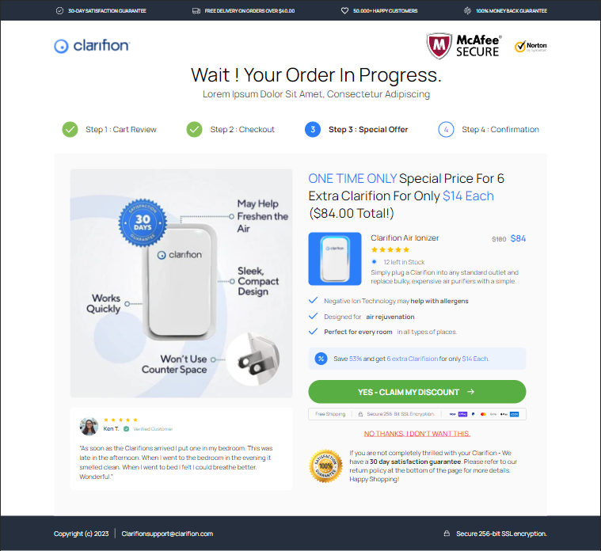
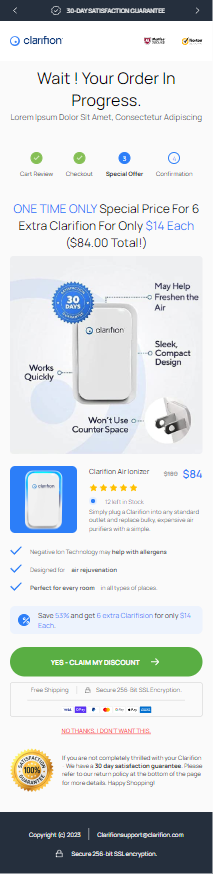

# Full Stack Developer - Test Assignment

## Table of contents

- [Overview](#overview)
  - [The challenge](#the-challenge)
  - [Instructions](#instructions)
  - [Screenshot](#screenshot)
  - [Links](#links)
- [My process](#my-process)
  - [Built with](#built-with)
- [Author](#author)

## Overview

### The challenge

We are looking to create a new upsell page for one of our products. The graphic designer has created a UI/UX design using Figma.  
We need you to create a working webpage that we can visit with a public URL, that is pixel perfect to the design we provide in Figma.

### Instructions:

1. Recreate the Figma design with your software of choice.
2. You may use any software or page builder you want to recreate the design.
3. Design must also be mobile formatted.

### Screenshot

  

### Links

- Live Site URL: [https://clarifion-upsell.netlify.app/](https://clarifion-upsell.netlify.app/)

## My process

### Built with

- Semantic HTML5 markup
- CSS custom properties
- Flexbox
- CSS Grid
- Vanilla JavaScript

## Author

- Github - [Jonatan Garbuyo](https://github.com/JonatanGarbuyo)
